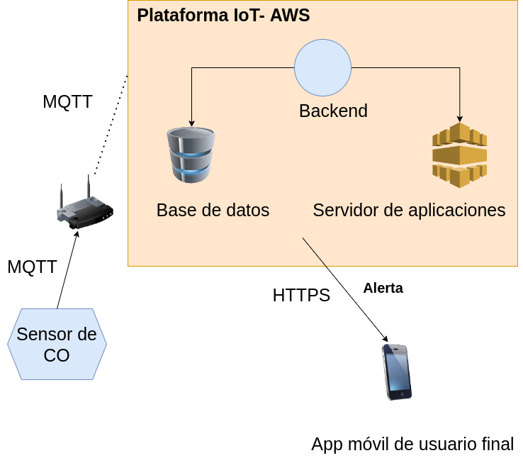

# Ejercicio CiberKillChain - Ataque

Haga una copia de este documto

## Alumno

Leonardo Mancini

## Enunciado

Armar una cyberkillchain usando técnicas de la matriz de Att&ck para mi trabajo final "Alarma para detección de CO en el hogar"

## Datos trabajo práctico

El trabajo practico consiste en una alarma sensora de presencia de CO que estará conectada a Internet mediante Wi-Fi. El objetivo de la alarma es sensar peridicamente el nivel de CO y en caso de superarse el umbar de peligro se enviará un evento de alerta al servidor cloud. 
También cuenta con un módulo GSM con una SIM para enviar a contactos asociados un mensaje de alerta. La alarma puede ser configurada mediante una aplicación móvil que funciona en ANdroid y Ios. El cliente, luego de adquirir el producto, es dado de alta en el sistema para que pueda ser monitoreado, ya que la empresa al recibir un evento de alarama envia alguien al hogar para ver la situacion y proceder al auxilio.

Diagrama del sistema:

## Resolución

### Reconnaissance

####
Si bien el hardware es sensillo, se puede adquirir el producto para probarlo un tiempo y realizar ingeniería inversa del mismo. Una vez adquirido se puede utilizar el puerto JTAG o soldar uno para recuperar el firmware y encontrar que certificado de seguridad utiliza y a que servidor se conecta.
En este caso se descubre que utiliza comunicación MQTT que se conecta a un servidor de google. Además se descubre que el frimware del dispositivo se puede acatualizar mediante OTA.

### Weaponization

####

Desarrollar una copia del firmware que, utilizando el certificado correcto, envíe información falsa a los servidores y ademas permita acceder remotamente al dispositivo. Esto último se podría realizar instalando un broker mqtt propio y que el dispostivo se suscriba ahí.

### Delivery
E
Enviar mediante OTA la nueva version del firmware del dispositivo falso.

### Exploit
Cuando cada dispositivo descargue la nueva versión de firmware.

### Installation
Mediante OTA se instalará la nueva versión del firmware corrupto.

### Command & Control

-Dispoitivo de CO
    - El atacante accede a cada uno de los dispositivos mediante la puerta trasera instalada.

### Actions on Objectives
El atacante puede generar falsos eventos de alarma, eliminar contactos, puede saturar el sistema enviando alarmas falsos de clientes falsos todo esto para generar una mala imagen de la empresa. 
Por último al ser un producto del que depende la vida humana se corre el riesgo de perdidad muy valiosas.

